# Microsoft Entra ID Identity Lifecycle Management
### Joiner, Mover, Leaver Workflow: Wieloch Health Center (Fictional Org)

**Author:** Mitchell P. Wieloch

**Purpose:** Hands-on Microsoft Entra ID lab demonstrating how access is provisioned, changed, and removed across the employee lifecycle: built directly on the [RBAC Access Governance Model](https://github.com/mpwieloch/rbac-access-governance-model) project.

**Deliverables:**

- This README: workflow narrative with embedded evidence
- [`Entra_Identity_Lifecycle_Test_Log.xlsx`](./Entra_Identity_Lifecycle_Test_Log.xlsx): structured test cases with expected/actual results

---

## 1. Overview

This project documents a hands-on Microsoft Entra ID identity lifecycle implementation for a fictional 20-employee healthcare organization, Wieloch Health Center, built in a live Entra ID lab tenant (`mpwielochcox.onmicrosoft.com`). It captures how user access is provisioned at hire (joiner), changed during a role transition (mover), removed at termination (leaver), and how time-limited contractor access is handled.

This builds directly on the RBAC Access Governance Model project: that project defined what access each role *should* have; this project demonstrates how that access is actually granted, changed, and revoked throughout the identity lifecycle in a working directory.

Access in this model is assigned exclusively through security group membership rather than direct per-user application grants, so a role or group change automatically changes what a user can access. All four lifecycle scenarios below were tested and validated directly in the lab tenant, with screenshots captured as evidence.

---

## 2. Security Group Structure

Eight security groups were created in the lab tenant, one per fictional role. Group membership is the sole access-control mechanism used in this model: no user was granted direct application access outside their group.

| Group | Department | Role(s) | Access Granted |
|---|---|---|---|
| SG-HR-Users | HR | HR Manager | Workday, HR SharePoint, AD account create/disable |
| SG-Finance-Users | Finance | Finance Analyst | ERP transactions only, no approvals |
| SG-Sales-Users | Sales | Sales Representative | CRM, own records only |
| SG-Clinical-Users | Clinical | Nurse | EHR, scoped to assigned unit |
| SG-IT-HelpDesk | IT | Help Desk Technician | AD standard, Entra limited user admin |
| SG-IT-Admins | IT | IT Systems Admin | AD Domain Admin; Entra Global Admin (PIM recommended) |
| SG-Compliance-Users | Compliance | Compliance Officer | Read-only audit log access |
| SG-Contractors | IT / Vendor | Contractor | AD standard, time-limited |

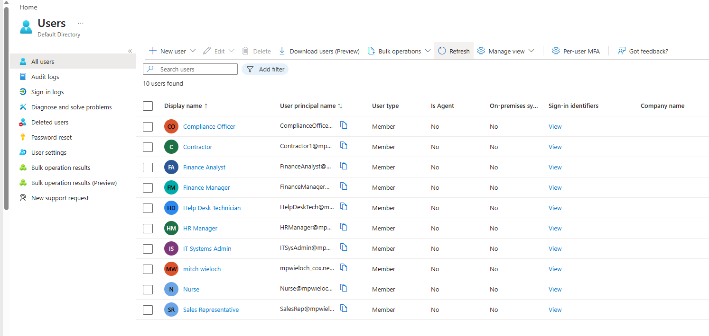
*Figure 1: Fictional employee population created in the lab tenant (Users > All users)*

---

## 3. Joiner Workflow: New Hire Provisioning

**Scenario:** Jessica Carter joins Wieloch Health Center as a Finance Analyst.

| Field | Detail |
|---|---|
| New Hire | Jessica Carter |
| User Principal Name | JessicaCarter@mpwielochcox.onmicrosoft.com |
| Job Title | Finance Analyst |
| Department | Finance |
| Step 1 | HR identifies new hire and requests account creation |
| Step 2 | Identity created in Entra ID with job title and department attributes set, account enabled |
| Step 3 | Role determined based on job title: Finance Analyst |
| Step 4 | User added to SG-Finance-Users: access provisioned through group membership, not direct grants |
| Step 5 | Finance system access inherited automatically via group membership |
| Step 6 | Provisioning verified directly in the tenant (see evidence below) |
| Design Note | Group assignment was performed as a deliberate separate step after identity creation, to clearly demonstrate role-based provisioning rather than ad hoc access at hire |

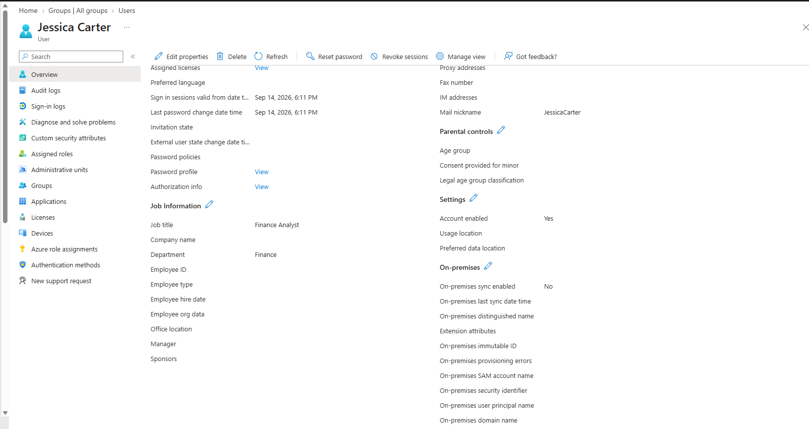
*Figure 2: Jessica Carter's profile at creation: Job title = Finance Analyst, Department = Finance, Account enabled = Yes*

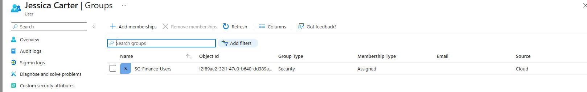
*Figure 3: Jessica Carter's group membership confirming SG-Finance-Users assignment*

---

## 4. Mover Workflow: Role Change

**Scenario:** Jessica Carter transitions from Finance Analyst to Sales Representative.

| Field | Detail |
|---|---|
| Employee | Jessica Carter |
| Previous Role / Group | Finance Analyst: SG-Finance-Users |
| New Role / Group | Sales Representative: SG-Sales-Users |
| Step 1 | Existing access reviewed against new role |
| Step 2 | Job title updated to Sales Representative; department updated to Sales |
| Step 3 | Removed from SG-Finance-Users (old access revoked) |
| Step 4 | Added to SG-Sales-Users (new access granted) |
| Step 5 | Final group membership verified: no residual Finance access remained |
| Validates | Directly tests the stale-access and over-provisioning findings from the RBAC Access Governance Model project |

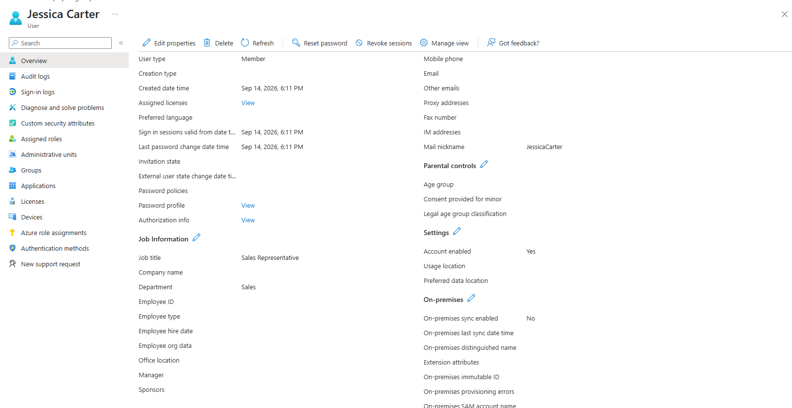
*Figure 4: Jessica Carter's profile after the role change: Job title = Sales Representative, Department = Sales*

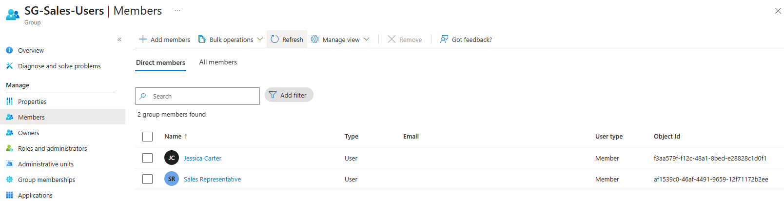
*Figure 5: SG-Sales-Users membership confirming Jessica Carter was added to the new role's group*

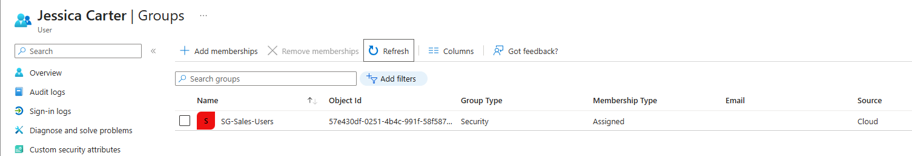
*Figure 6: Jessica Carter's group list showing only SG-Sales-Users, confirming SG-Finance-Users access was fully removed*

---

## 5. Leaver Workflow: Termination

**Scenario:** Jessica Carter is terminated and offboarded. The same identity used in the joiner and mover scenarios above is carried through to termination, modeling a complete employee lifecycle.

| Field | Detail |
|---|---|
| Employee | Jessica Carter (same identity used across joiner, mover, and leaver scenarios) |
| Step 1 | Termination initiated |
| Step 2 | Account status set to Disabled in Entra ID |
| Step 3 | Removed from SG-Sales-Users |
| Step 4 | Group membership confirmed empty ("Not a member of any groups") |
| Step 5 | Access removal verified directly in the tenant |
| Design Note | Identity retained (not deleted) to preserve an audit trail, consistent with standard offboarding practice. Using one identity across all three stages models a realistic full employee lifecycle rather than three disconnected test users. |

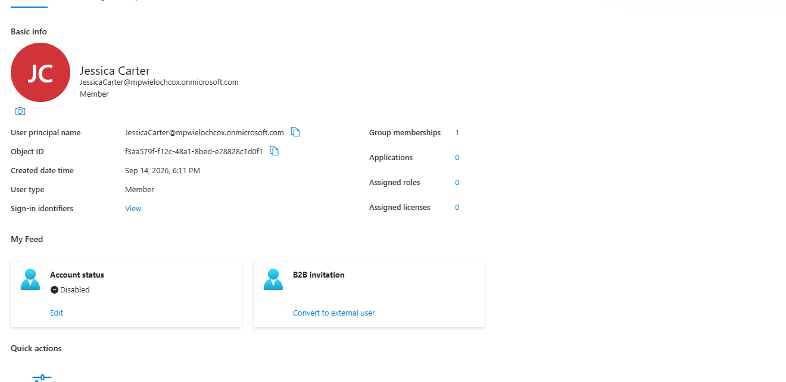
*Figure 7: Jessica Carter's account status set to Disabled*

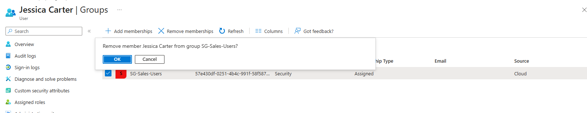
*Figure 8: Removing Jessica Carter's membership from SG-Sales-Users*

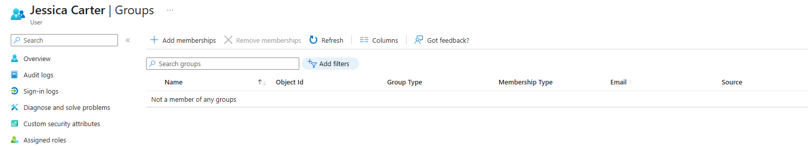
*Figure 9: Confirmation that Jessica Carter is no longer a member of any groups*

---

## 6. Contractor Workflow: Access Expiration

**Scenario:** A contractor's engagement ends and their access must be removed without deleting their identity.

| Field | Detail |
|---|---|
| Contractor | Contractor (Contractor1@mpwielochcox.onmicrosoft.com) |
| Step 1 | Contractor identity created with role-based access via SG-Contractors |
| Step 2 | At simulated contract end, membership removed from SG-Contractors |
| Step 3 | Account status confirmed to remain Enabled: identity retained, only group-based access removed |
| Step 4 | Group membership confirmed empty after removal |
| Honesty Note | Contractor access expiration was manually simulated because a native contract end-date/expiration field was not available through the current Entra user-management interface in this tenant. This is documented explicitly rather than claiming automatic expiration. |

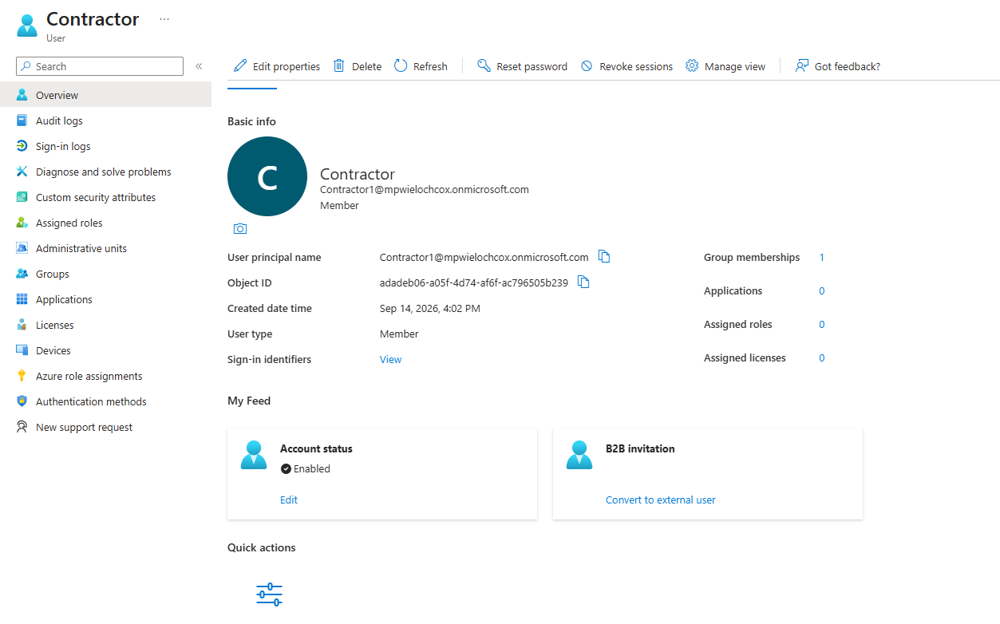
*Figure 10: Contractor profile showing Account status = Enabled prior to access removal*

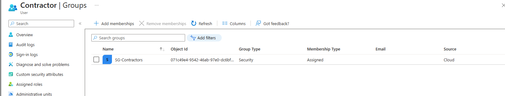
*Figure 11: Contractor's group membership showing SG-Contractors prior to removal*

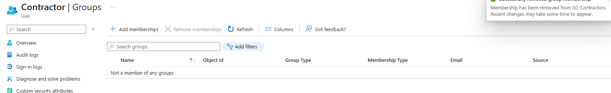
*Figure 12: Confirmation that group membership was removed from SG-Contractors; identity remains intact*

---

## 7. Licensing and Implementation Notes

This project was built in a live Microsoft Entra ID lab tenant rather than a paid production environment. Where a native feature (such as automatic contract-based account expiration) was not available in the current licensing tier, that limitation is documented honestly in the test log rather than presented as fully automated. All four lifecycle scenarios were otherwise implemented and verified directly in the tenant: not simulated on paper.

---

## 8. Key Takeaways / What This Demonstrates

- Group-based access provisioning as the enforcement mechanism for least privilege, implemented and tested in a live directory
- Understanding of the full identity lifecycle: joiner, mover, leaver, and contractor expiration: not just static role definitions
- Verification discipline: proving old access is removed during a role change, not just that new access was added
- Honest documentation of licensing constraints and what was manually simulated vs. natively automated
- Direct continuity with the RBAC Access Governance Model project: this project operationalizes those governance findings into working lifecycle controls

---

*This is a self-directed lab project using a fictional organization and simulated data in a personal Microsoft Entra ID tenant: no real client, employer, or individual data was used.*
